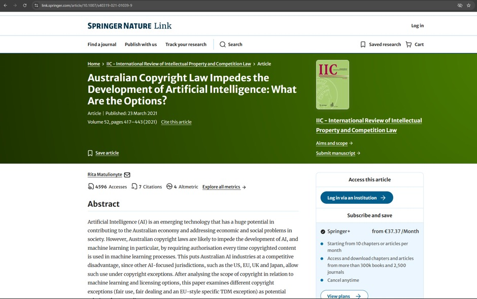
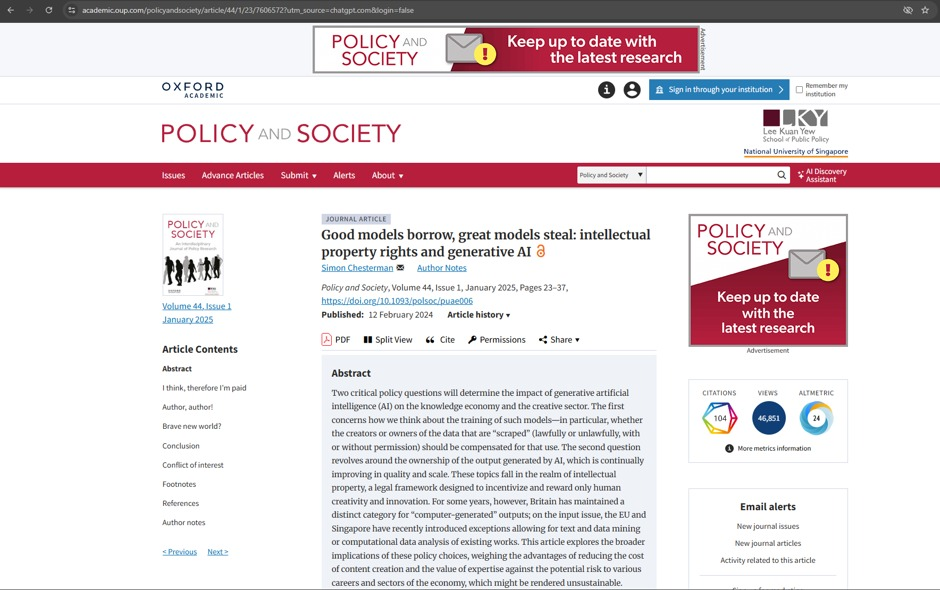
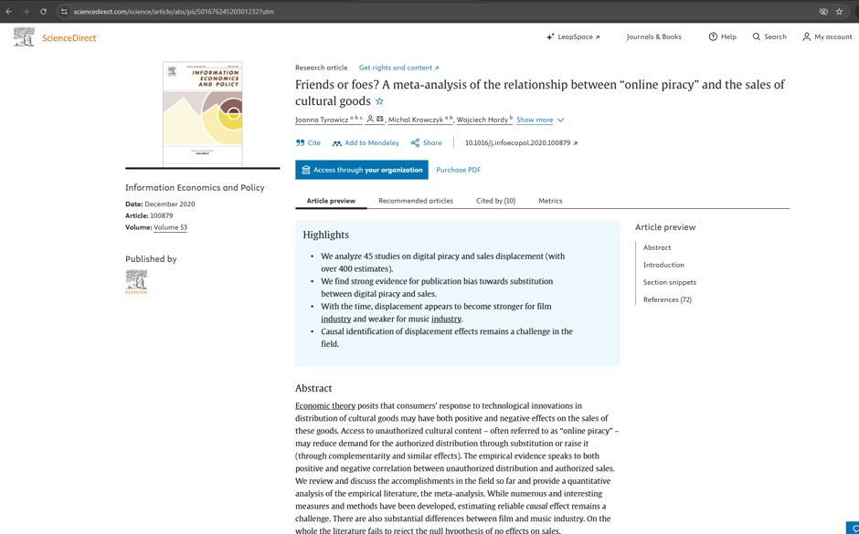
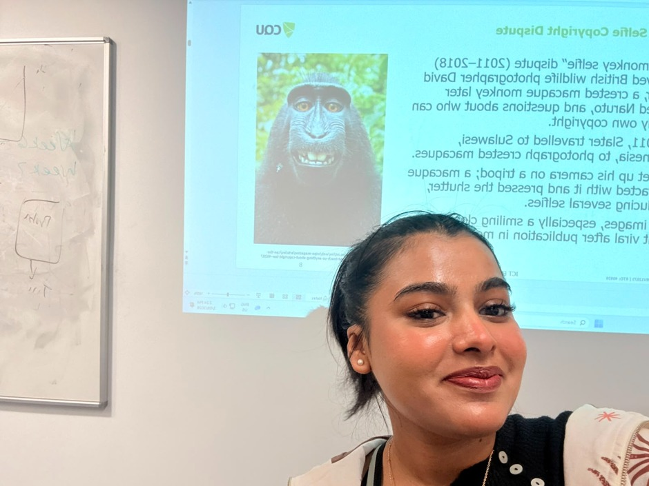
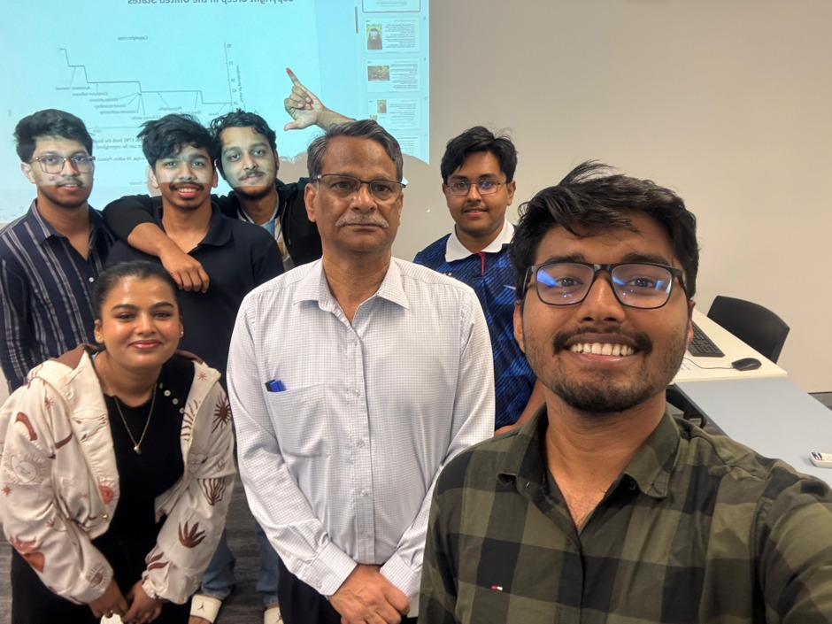

# e-portfolio 3 – Intellectual Property 

A collection of artefacts that demonstrate what I have learnt about Intellectual Property this week. 

## Artefact 1: Australian Intellectual Property and Competition Law 

## https://link.springer.com/article/10.1007/s40319-021-01039-9

**Summary of Artefact:**

It looks at the potential impact of Australian copyright law on the progress of artificial intelligence, particularly machine learning. AI systems frequently include copyrighted material in their training processes, and this could necessitate a license under Australian copyright law. The copyrighted information may be used extensively in the training of AI systems, where it could be used by the systems without permission under Australian copyright law. This adds to the legal uncertainty and cost to AI developers. It contrasts Australia with the U.S., UK, Japan and the European Union, where there are more broad copyright exceptions, and explores the opportunities for reform, such as fair use and fair dealing rules, the exception to copyright for text and data mining, and more.  

**Justification to the Artefact:**

I choose this paper since there is a direct connection with topics of copyright, fair use/fair dealing raised in Week 7 and it connects these points to a current technology issue. It also taught me how copyright law can enable creators to protect their work while also restricting innovation when it does not keep pace with the development of new technologies. The focus on Australia was particularly relevant to this course for me. 

## Artefact 2: Intellectual Property Rights and Generative AI 
**Screenshot**

## https://academic.oup.com/policyandsociety/article/44/1/23/7606572?utm_source=chatgpt.com&login=false

**Summary of Artefact:**

The paper explores two significant intellectual property issues raised by generative AI. The first is whether authors should be paid if they have copyrighted material used to train AI algorithms. Second, it explores who should be the owner of AI outputs and whether they should be subject to copyright protection. Chesterman also contrasts other legal methods, such as exceptions in relation to text-and-data-mining, and underscores the conundrum of balancing technological advancement with the protection of individual human creators who could be benefiting a particular AI system. 

**Justification on the Artefact:**

I selected this paper as it had relevance to the Week 7 topics Copyright and IP issues, and AI generated works. It helped me to recognize that generative AI is going to bring with it legal challenges, not just with the output that it generates, but also with the actual content that it's trained on. Also interesting was the discussion regarding humanity's creativity, ownership and compensation, as the questions related to these are increasingly coming up as more people use AI increasingly in creative and professional endeavours. 

## Artefact 3: Relationship Between “online piracy” and the Sales of Cultural Goods 

## https://www.sciencedirect.com/science/article/abs/pii/S0167624520301232?utm

**Summary of Artefact:**

The paper examines the relationship between online piracy and sales of cultural goods such as music and films. The authors make a review of previous studies and make a comparison of them using a meta analysis. They state that, while the sale of pirated products might lead to a decrease in the legal products sold because people substitute them for legal products, there might also be an increase in the legal products sold through exposure or complementary effects. In summary, there is mixed evidence and the researchers suggest that overall, the existing research has yet to reveal a clear overall effect of piracy on sales. 

**Justification on the Artefact:**

This paper is selected as it directly relates to Week 7 content addressing copyright and digital content and intellectual property. It got me to realize that online piracy is a more complicated issue than simply declaring that a lost sale is a lost sale. The comparison of many studies turned out to be useful in my opinion, as it indicated a number of reasons why copyright policy should take into account evidence, consumer behaviour and technological change when assessing the actual effect of piracy. 

## Artefact 4: Week 7 Workshop: The Monkey Selfie Copyright Dispute.

**Week 7 workshop (Thursday 03/09/2026) selfie with my tutor Umapathy Venugopal sir and classmates**

****
****

**Summary of the Artefact**

The key idea that stood out to me in the Week 7 workshop was the Monkey Selfie Copyright Dispute. A macaque posed for photographer David Slater's camera, taking photos which reignited a debate about ownership of the copyright. The photos were designated as public domain by Wikimedia due to human authorship being a requirement for copyright, but Slater believed that his preparation enabled the photos to be created. The case contained interesting queries about authorship that are now also applicable to the AI-generated content (COIT11223 Workshop Week 7 2026). 

**Justification on the Artefact**

The choice of workshop idea was motivated by me finding the case unusual, but with strong links to modern ICT. In the beginning, I thought that a camera owner should automatically be the owner of the pictures he/she takes with it. I then realised that copyright is based on authorship not just the ownership of the technology. It also got me to think about AI images as copyright is not an asset of the AI. It was a discussion that guided me through the ethical discussion of how new technologies can raise questions of ethics that may not not be well defined by current copyright laws (COIT11223 Workshop Week 7, 2026). 

## Reference:

Chesterman, S 2025, ‘Good models borrow, great models steal: intellectual property rights and generative AI’, Policy and Society, vol. 44, no. 1, pp. 23–37, viewed 6 September 2026.  

Matulionyte, R 2021, ‘Australian copyright law impedes the development of Artificial Intelligence: what are the options?’, IIC – International Review of Intellectual Property and Competition Law, vol. 52, no. 4, pp. 417–443, viewed 6 September 2026.  

Tyrowicz, J, Krawczyk, M & Hardy, W 2020, ‘Friends or foes? A meta-analysis of the relationship between “online piracy” and the sales of cultural goods’, Information Economics and Policy, vol. 53, article 100879, viewed 6 September 2026. 

CQUniversity Australia 2026, COIT11223 ICT Ethics and Governance in Society: Week 7 – Intellectual Property, PowerPoint presentation, CQUniversity Australia, viewed 5 September 2026. 
